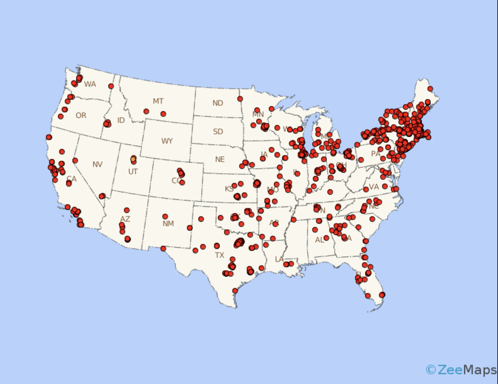
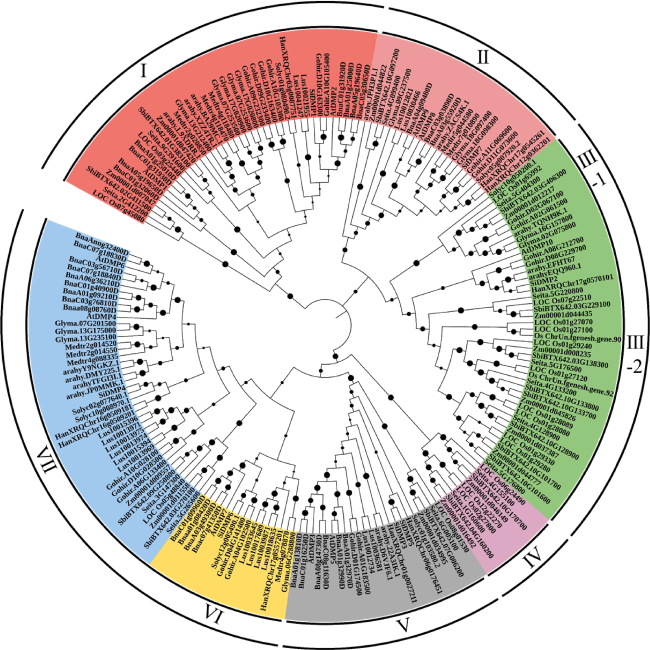

```{r, include=FALSE}
knitr::opts_chunk$set(
  echo = FALSE,      
  warning = FALSE,   
  message = FALSE,   
  results = 'hide',  
  fig.show = 'hold'  
)
```

<!-- Estil global per a totes les imatges del document -->

<style>
img.fullwidth {
  display: block;
  margin: 20px auto;
  width: 100%;
  max-width: 900px;
  height: auto;
  border-radius: 10px;
}
</style>

<div style="position: relative;">
  
</div>

# Introducció

En aquesta PAC 2 es demana sortir de la zona de confort explorant **tres tècniques de visualització** diferents.
L’objectiu és entendre’n **l’origen, el funcionament, els avantatges i limitacions**, i crear una **visualització pròpia** amb dades obertes per a cadascuna.

Les tècniques assignades són:

1. Dot Density Map\
2. Circular Dendrogram\
3. UpSet Plot

---

# 1. Dot Density Map

## Definició i origen

El **Dot Density Map** (o *dot distribution map*) és una tècnica de **cartografia temàtica** que representa la distribució espacial d’un fenomen mitjançant punts.
Cada punt representa una ocurrència (o un nombre determinat de casos) dins d’una regió o polígon geogràfic.

Aquesta tècnica té una llarga tradició en la cartografia (més de 150 anys d’ús). Avui s’utilitza àmpliament en GIS i visualització de dades modernes.

<div style="text-align: center;">
  
</div>

## Funcionament

* Cada punt simbolitza una quantitat determinada d’un fenomen (p. ex. 1 punt = 1 estació).
* Els punts es distribueixen dins d’una àrea, sovint de manera aleatòria o ponderada (per exemple, proporcional a població).
* Zones amb més punts indiquen major concentració; zones amb menys, baixa densitat.
* S'ha d'especificar clarament la **unitat del punt** (què representa cada punt) per evitar interpretacions errònies.

## Avantatges

* Visualització **intuitiva** i fàcil d'interpretar per maps de densitat.
* Permet comparar patrons espacials entre regions diferents.
* Pot mostrar múltiples categories utilitzant diferents colors o capes.

## Inconvenients

* Amb alt nombre de punts pot resultar **saturat** i perdre informació.
* La generació aleatòria de punts dins polígons pot induir variabilitat (problema de reproducibilitat si no es fixa la llavor).
* Subjecte al MAUP (modifiable areal unit problem): la mida i forma de les unitats administratives afecta la percepció.

## Tipus de dades

* Dades geoespacials amb punts o geometries polígon (municipis, comarques, codis postals).
* Variables quantitatives agregades (població, incidents, punts d'interès).

## Aplicacions habituals

* Densitat de població, habitatge o serveis.
* Distribució d’infraestructures: estacions de recàrrega, hospitals, escoles.
* Visualització de distribució d’esdeveniments puntuals (accidents, crims, etc.).

## Exemple d’aplicació (codi i dades)

```{r}
library(sf)
library(ggplot2)
library(mapSpain)
library(dplyr)
library(readr)
library(stringr)
library(plotly)
library(tidyr)

# Exemple d'ús amb fitxer d'estacions (fitxer local)
df <- read_csv("data/Estacions_de_recàrrega_per_a_vehicle_elèctric_a_Catalunya_20251105.csv")
df_sf <- st_as_sf(df, wkt = "Georeferència", crs = 4326)
cat_map <- esp_get_ccaa("Catalunya")

ggplot() +
  geom_sf(data = cat_map, fill = "gray95", color = "gray70") +
  geom_sf(data = df_sf, color = "#0072B2", alpha = 0.6, size = 1) +
  labs(
    title = "Estacions de recàrrega per a vehicles elèctrics a Catalunya",
    subtitle = "1 punt = 1 estació de recàrrega",
    caption = "Dades: Generalitat de Catalunya (Open Data)"
  ) +
  theme_minimal()
```

```{r}
df <- read_csv("data/Estacions_de_recàrrega_per_a_vehicle_elèctric_a_Catalunya_20251105.csv")

#Convertim la columna 'Georeferència' a geometria sf
df_sf <- st_as_sf(df, wkt = "Georeferència", crs = 4326)

#Extraiem coordenades
coords <- st_coordinates(df_sf)
df_sf <- df_sf %>%
  mutate(lon = coords[, 1], lat = coords[, 2])

#Neteja bàsica
df_sf <- df_sf %>%
  filter(!is.na(`TIPUS VELOCITAT`), !is.na(POTENCIA))

#Separem els casos combinats
df_sf <- df_sf %>%
  mutate(`TIPUS VELOCITAT` = str_split(`TIPUS VELOCITAT`, " i ")) %>%
  tidyr::unnest(`TIPUS VELOCITAT`) %>%
  mutate(`TIPUS VELOCITAT` = str_trim(`TIPUS VELOCITAT`))

#Afegim la categoria Tots
vel_types <- sort(unique(df_sf$`TIPUS VELOCITAT`))
vel_types <- c("Tots", vel_types)

#Creem una traça per a cada tipus de velocitat
plots <- lapply(vel_types, function(v) {
  if (v == "Tots") {
    df_filt <- df_sf
  } else {
    df_filt <- df_sf %>% filter(`TIPUS VELOCITAT` == v)
  }

  list(
    type = "scattermapbox",
    mode = "markers",
    lon = df_filt$lon,
    lat = df_filt$lat,
    marker = list(
      size = 8,
      opacity = 0.8,
      color = df_filt$POTENCIA,
      colorscale = "Viridis",
      colorbar = list(title = "Potència (kW)")
    ),
    text = paste0(
      "<b>Municipi:</b> ", df_filt$MUNICIPI,
      "<br><b>Potència:</b> ", df_filt$POTENCIA, " kW",
      "<br><b>Tipus:</b> ", df_filt$`TIPUS VELOCITAT`
    ),
    hoverinfo = "text",
    name = v,
    visible = ifelse(v == "Tots", TRUE, FALSE)
  )
})

#Afegim les traces correctament
p <- plot_ly()
for (pl in plots) {
  p <- do.call(add_trace, c(list(p), pl))
}

#Botons per canviar tipus de velocitat
buttons <- lapply(seq_along(vel_types), function(i) {
  vis <- rep(FALSE, length(vel_types))
  vis[i] <- TRUE
  list(
    method = "update",
    args = list(list(visible = vis)),
    label = vel_types[i]
  )
})

p <- layout(
  p,
  mapbox = list(
    style = "open-street-map",
    zoom = 7.2,
    center = list(lon = 1.6, lat = 41.8)
  ),
  updatemenus = list(list(
    buttons = buttons,
    direction = "down",
    x = 0.05, y = 1.1,
    showactive = TRUE
  )),
  title = list(
    text = "🚗 Estacions de recàrrega per tipus de velocitat a Catalunya",
    x = 0.5
  ),
  margin = list(l = 0, r = 0, b = 0, t = 50)
)

p

htmlwidgets::saveWidget(as_widget(p), "docs/dot_density_map_plotly.html", selfcontained = TRUE)

```

---

# 2. Circular Dendrogram

## Definició i origen

El **Circular Dendrogram** (o *Radial Dendrogram*) és una variació del **dendrogram jeràrquic** tradicional en què l'arbre s'organitza de manera radial al voltant d'un eix central.
Els dendrograms deriven de tècniques d'**anàlisi jeràrquica** (hierarchical clustering), emprades històricament en disciplines com la biologia i la taxonomia per mostrar relacions de parentesc o similitud.

El format circular es va popularitzar en bioinformàtica i visualització perquè **maximitza l'ús de l'espai** quan hi ha molts terminals (fulles), facilitant la visualització de centenars o milers de fulles sense tallar l'arbre en pàgines llargues.

<div style="text-align: center;">
  
</div>

## Funcionament

* Partim d'una matriu de distàncies o d'una matriu de similitud entre elements.
* S'aplica un mètode d'agregació jeràrquica (p.ex. **UPGMA**, **Ward**, **single**, **complete**, o **neighbor-joining** en filogenètica).
* El resultat és un arbre (`hclust`, `phylo`) que s'ordena radialment: l'arrel al centre i les fulles al perímetre.
* Les longituds de branca poden representar distàncies (si s'utilitzen mètodes que conserven longituds) o bé només la jerarquia (si `branch.length = "none"`).
* Es poden codificar atributs addicionals en color de branques, gruix, o etiquetes.

## Avantatges

* **Ocupa menys espai** vertical que un dendrogram lineal per a molts terminals.
* Millora la percepció de patrons globals i simetries en l'arbre.
* Ideal per integrar metadades (colores en branques, heatmaps externs).

## Inconvenients

* Les etiquetes poden ser **difícils de llegir** si hi ha moltes fulles — sovint cal rotar o incloure etiquetes interactives.
* La distància radial no sempre és directa d'interpretar; la comprensió de longituds radial/anglars pot confondre usuaris no tècnics.
* Per a comparacions quantitatives rigoroses entre distàncies, els dendrograms lineals poden ser més clars (sobretot si es necessiten escales legibles).

## Tipus de dades

* Dades jeràrquiques o resultats d'agrupament: clustering de gens, espècies, documents, usuaris, etc.
* Matrius de distància (Euclidiana, cosinus, identitat, distàncies evolutives).
* Formats R habituals: objectes `hclust`, `dendrogram`, `phylo`.

## Aplicacions habituals

* Filogenètica: arbres evolutius construïts amb mètodes com **neighbor-joining** o **maximum likelihood** (visualització).
* Anàlisi de clustering en ciència de dades: agrupament d'expressions gèniques, patrons de consum, segmentacions.
* Mapes jeràrquics d'organitzacions, taxonomies de categories, visualització de l'estructura d'arbres de decisions.

## Exemple d’aplicació (seqüències proteiques)

En l’exemple següent es parteix d’un fitxer FASTA amb seqüències proteiques, es realitza una alineació múltiple, es calcula una matriu de distàncies i es construeix un arbre amb l’algorisme **Neighbor-Joining** (un mètode molt emprat per construcció ràpida d'arbres filogenètics). El gràfic final s'exporta a PNG.

```{r}
library(DECIPHER)
library(Biostrings)
library(ape)
library(ggtree)
library(stringr)

# Fitxer fasta amb seqüències proteïna: seqs.fasta
fasta_path <- "data/seqs.fasta"
seqs <- readAAStringSet(fasta_path)

# Extracció de noms d'organisme si els headers segueixen el patró "OS=... OX="
new_names <- str_extract(names(seqs), "(?<=OS=).*?(?= OX=)") %>% str_trim()
names(seqs) <- ifelse(is.na(new_names) | new_names == "", names(seqs), new_names)

# Alineament, conversió i càlcul de distàncies
alignment <- AlignSeqs(seqs)                    # AlignSeqs de DECIPHER
alignment_mat <- as.matrix(alignment)
aligned_bin <- as.AAbin(alignment_mat)
dist_mat <- dist.aa(aligned_bin)                 # dist.aa (identitat / percentatge diferent)

# Construcció arbre amb Neighbor-Joining
tree <- nj(dist_mat)

# Visualització circular amb ggtree
p <- ggtree(tree, layout = "circular", branch.length = "none") +
  xlim_tree(12) +
  geom_tiplab(aes(angle = angle), size = 3, hjust = 0, offset = 0.1) +
  theme_void() +
  ggtitle("Circular dendrogram – Conserved RPL3 gene (UniProt sequences)") +
  theme(plot.title = element_text(hjust = 0.5, face = "bold"))

print(p)
ggsave("docs/circular_dendogram.png", plot = p, width = 8, height = 6, dpi = 300)
```

---

# 3. UpSet Plot

## Definició i origen

L’**UpSet Plot** és una tècnica per visualitzar **conjunts i les seves interseccions** de manera escalable i quantitativa. Va ser introduïda per **Alexander Lex et al. (2014)** com a alternativa als diagrames de Venn i Euler, que esdevenen difícils de llegir a partir de 3 conjunts o més. L’aplicació és especialment valuosa quan es vol analitzar quantitats d'elements en interseccions específiques i combinar aquesta informació amb metadades.

<div style="text-align: center;">
  
</div>

## Funcionament

* Es construeix una **matriu de presència/absència** on cada fila és un element i cada columna un conjunt.
* Les diferent combinacions de presència (interseccions) es representen com files en una matriu de punts.
* Un gràfic de barres superior mostra la mida de cada intersecció (nombre d’elements que compleixen exactament aquella combinació).
* Un gràfic lateral mostra la mida de cada conjunt individual (cardinalitat).
* Es poden afegir mètriques a les barres (p.ex. proporció d'un outcome com morts, mitjana d'una variable, etc.).

## Avantatges

* **Escalable**: funciona bé amb molts conjunts (10+, si cal).
* Mostra clarament **quines interseccions són més freqüents** i la seva mida.
* Permet afegir informació quantitativa addicional (colors, valors laterals).
* És fàcil ordenar les interseccions per mida, proporció o qualsevol mètrica rellevant.

## Inconvenients

* Pot ser menys intuïtiu per a usuaris no acostumats a la matriu de punts.
* Amb masses interseccions diferents (p.ex. 2^n molt gran) cal filtrar i agrupar per interpretar les principals.
* Requereix preparar correctament la matriu de presència/absència (neteja i definició de conjunts).

## Tipus de dades

* Elements amb pertinença a conjunts (gens en experiments, clients per categories de compra, accidents amb tipus de vehicle, etc.).
* Dades binàries (TRUE/FALSE) per cada conjunt, o convertibles a binari.

## Aplicacions habituals

* Genòmica: conjunts de gens diferentsament expressats en condicions múltiples.
* Anàlisi de clients: combinacions de categories de compra.
* Epidemiologia/seguretat: combinacions d'exposicions o factors en incidents.

## Exemple d’aplicació (accidents de trànsit)

A continuació hi ha el codi que processa un dataset d'accidents (fitxer local) per construir les interseccions entre tipus de vehicles implicats i obtenir mesures com el nombre d'accidents i la proporció de morts per cada combinació. El resultat es mostra com un UpSet-like plot (barra superior + matriu).

```{r}
library(readr)
library(dplyr)
library(tidyr)
library(ggplot2)
library(scales)
library(patchwork)

# Llegim dades (fitxer local)
df <- read_csv("data/Accidents_de_trànsit_amb_morts_o_ferits_greus_a_Catalunya_20251106.csv")
sets <- c("vianant", "bici", "ciclomotor", "moto", "lleuger", "pesant")

# Construïm booleans per pertinença a cada conjunt
df_filt <- df %>%
  mutate(
    vianant = F_VIANANTS_IMPLICADES > 0,
    bici = F_BICICLETES_IMPLICADES > 0,
    ciclomotor = F_CICLOMOTORS_IMPLICADES > 0,
    moto = F_MOTOCICLETES_IMPLICADES > 0,
    lleuger = F_VEH_LLEUGERS_IMPLICADES > 0,
    pesant = F_VEH_PESANTS_IMPLICADES > 0,
    mortal = F_MORTS > 0
  )

# Matriu binària i etiquetes de combinacions
binmat <- as.matrix(df_filt %>% select(all_of(sets)) %>% mutate_all(~ as.integer(.)))
pattern <- apply(binmat, 1, paste0, collapse = "")
label <- apply(binmat, 1, function(r) {
  idx <- which(as.logical(r))
  if (length(idx) == 0) return("none")
  paste(sets[idx], collapse = ";")
})

# Resum per combinació: nombre d'accidents i morts
combos <- tibble(pattern = pattern, combo = label, mortal = df_filt$mortal) %>%
  group_by(pattern, combo) %>%
  summarise(n = n(), morts = sum(mortal, na.rm = TRUE), .groups = "drop") %>%
  mutate(prop_morts = if_else(n > 0, morts / n, 0)) %>%
  arrange(desc(n))

# Convertim cada combinació a una "filera" de presència per fer la matriu de punts
make_presence_df <- function(pat) {
  bits <- as.integer(strsplit(pat, "")[[1]])
  tibble(set = sets, present = as.logical(bits))
}

matrix_long <- combos %>%
  mutate(id = row_number()) %>%
  rowwise() %>%
  mutate(pres_df = list(make_presence_df(pattern))) %>%
  unnest_longer(pres_df) %>%
  unnest_wider(pres_df) %>%
  ungroup()

combo_order <- combos %>% filter(n > 0) %>% pull(combo)
matrix_long <- matrix_long %>%
  mutate(combo = factor(combo, levels = combo_order),
         set = factor(set, levels = rev(sets)))

# Gràfic superior: mida de les interseccions (color per proporció de morts)
p_top <- combos %>%
  filter(n > 0) %>%
  mutate(combo = factor(combo, levels = combo_order)) %>%
  ggplot(aes(x = combo, y = n, fill = prop_morts)) +
  geom_col() +
  scale_fill_viridis_c(labels = percent_format(accuracy = 1)) +
  labs(x = NULL, y = "Nombre d'accidents", fill = "Prop. morts",
       title = "Interseccions de tipus de vehicles implicats") +
  theme_minimal(base_size = 12) +
  theme(axis.text.x = element_blank(),
        axis.ticks.x = element_blank(),
        plot.title = element_text(hjust = 0.5, face = "bold"),
        legend.position = "right")

# Matriu de punts per a la matriu d'interseccions
p_matrix <- matrix_long %>%
  ggplot(aes(x = combo, y = set)) +
  geom_point(aes(alpha = present), size = 4) +
  scale_alpha_manual(values = c("FALSE" = 0, "TRUE" = 1), guide = "none") +
  labs(x = NULL, y = NULL) +
  theme_minimal(base_size = 11) +
  theme(axis.text.x = element_blank(),
        axis.text.y = element_text(face = "bold"),
        panel.grid = element_blank())

final_plot <- p_top / p_matrix + plot_layout(heights = c(2, 1))

if (!dir.exists("docs")) dir.create("docs")
ggsave("docs/UpSet.png", plot = final_plot, width = 14, height = 6, dpi = 300)

final_plot
```
